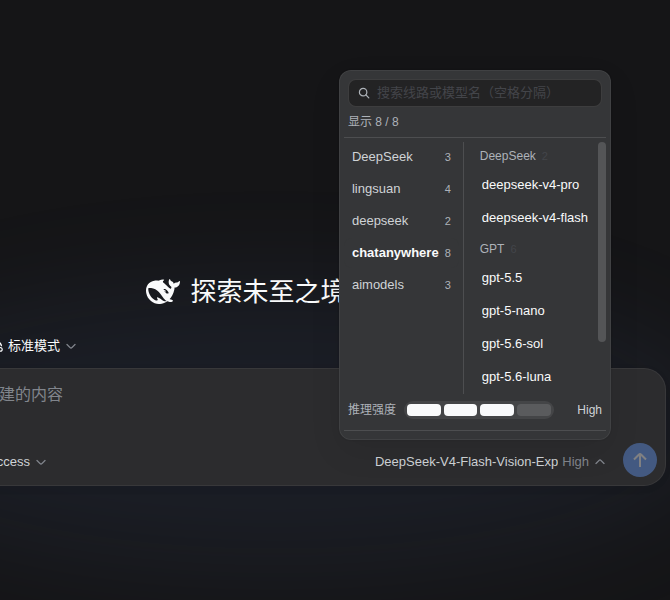
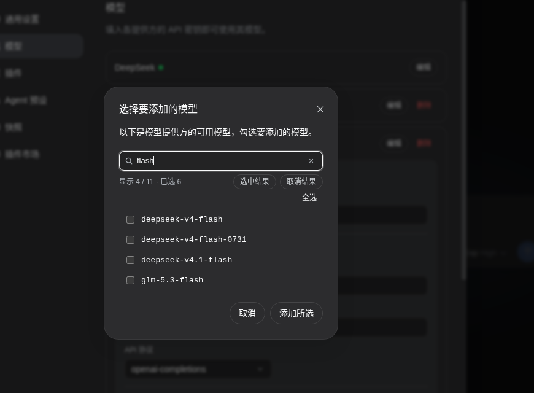

<div align="center">

# dsh-model-search

**把 DSH 的模型选择改成「先选线路、再选模型」，还带一条 Codex 式推理强度能量条**

上百个模型？左栏点线路，右栏按 DeepSeek / GPT / 其他分好组，秒定位。

[](LICENSE)
[](https://github.com/topics/dsh-plugin)
[](package.json)

**简体中文** · [English](README.en.md)

</div>

---

## 这个插件解决什么问题

在 DSH 里加自定义提供方（OpenAI 兼容网关、自建服务、中转站）时，点「**获取可用模型**」会拉回一张勾选列表。模型动辄几十上百个，而那个弹窗**没有搜索框**——只能滚着找。

装好之后还有两处同样的痛：

- 输入框旁的**模型菜单**把所有线路的模型平铺成一长列，找模型只能靠滚；
- **推理强度**藏在「模型 / 推理等级」的二级面板里，改一次要跳两层。

本插件把这三处一起改了：

<p align="center">
  
</p>

<p align="center">
  
</p>

以上都是本机真实运行的 DSH 界面截图（由 `node scripts/e2e-dsh.mjs` 用无头浏览器跑出来）。

## 功能

**① 模型菜单：两级选择（左栏线路 → 右栏模型）**

- 打开即两栏：**左栏是线路**（官方 / lingsuan / chatanywhere…，带模型条数，当前线路高亮），**右栏是这条线路的模型**
- 点左栏换线路，右栏立刻换成那条线路的模型；左栏不会消失，来回比较不用退出去重进
- **右栏按模型家族分组**：DeepSeek / GPT / Claude / Gemini / Qwen / GLM / Kimi / Grok / Llama / Mistral / MiniMax… 认不出的归「其他」并永远垫底。中转站里同一家族的模型散在各条线路上时，这一步就把它们收拢了
- 打开时**直接落到「模型」面板**，省掉「模型 / 推理等级」那次多余点击（`openToModels` 可关）
- **不会闪**：宿主的原始列表在同一帧内就被接管，你看到的第一个画面就是插件版的

**② 模型菜单：搜索**

- 顶部搜索框，边打边筛，一次筛两栏：左栏留下有命中的线路，右栏只留命中的模型
- 命中散在多条线路上时，左栏会出现「**所有线路**」，点进去就是跨线路的模型总表（仍按线路 + 家族分组）
- 搜不到时自动降级为子序列模糊匹配（`dsv4flash` → `deepseek-v4-flash`）并标注「模糊匹配」
- 当前线路一条都没命中时，右栏自动挪到第一个有命中的线路——不用自己去左栏再点一下

**③ 推理强度：同框能量条，可拖动**

- 就在模型菜单底部，与模型列表**同一个框**里：`推理强度 ▮▮▮▯ High`
- **拖**着走、**点**某一格、或者用 **←→ / ↑↓** 都行；拖动时实时预览，松手才落库
- 档位是**每个模型各自的真实档位**（从宿主的模型目录里读，而不是猜的：DeepSeek 官方模型是 Off/Low/High/Max，别的线路可能只有两三档），并带完整无障碍语义（`role="slider"` + `aria-valuenow/valuetext`）
- 提交走的正是宿主自己的 `directory.select()`，和你在菜单里点一下完全等价

**④ 「获取可用模型」弹窗：搜索 + 批量勾选**

- 顶部搜索框，多关键词空格分隔（AND），空结果自动模糊兜底
- 实时计数 `显示 6 / 19 · 已选 12`
- **「选中结果 / 取消结果」只作用于当前过滤出来的那几条**——把「先筛再全选」变成一次点击
- `Esc` 清空搜索（不会顺手关掉弹窗）、`↑↓` 在结果间移动、`Enter` 命中唯一结果直接勾上
- 打开即自动聚焦搜索框，可以直接开始打字

**⑤ 不打扰**

- 模型数少于 8 条时一律不介入，界面保持原样
- 两处可以分别关掉，两级选择也能关（`drilldown: false` 回到一屏列表）
- 纯客户端：不写配置、不起路由、不读凭据，卸载后一切照旧

## 安装

**方式一：官方命令（推荐）**

```bash
# 从 GitHub 安装（无需构建：产物已随仓库提交）
dsh plugin --profile web add github:Xstone1129/dsh-model-search
```

装完**刷新页面**；若没生效，重启 `dsh web`。

**方式二：手动（免重启，适合本机折腾）**

```bash
# 1. 放进 profile 的依赖里
cd ~/.dsh/profiles/web
pnpm add file:/path/to/dsh-model-search

# 2. 在该 profile 的 cordis.patch.yml 里插入插件条目（这个文件是热监听的，改完立即生效）
```

```yaml
- insert:
    - id: dsh-model-search
      name: 'dsh-model-search'
```

改完刷新页面即可，不用重启 `dsh web`。

> ⚠️ 两种方式**不要同时用**：同一个条目被插入两次会让插件被加载两遍。用方式一之前，先把方式二手写的那三行删掉。

## 使用

装好后不需要任何配置：

- **换模型**：点输入框旁的模型名 → 左栏选线路 → 右栏选模型（右栏会标出当前用的是哪个）
- **调推理强度**：菜单底部那条能量条，拖或点
- **添加模型**：设置 → 模型 → 某个自定义提供方的编辑 → 获取可用模型 → 搜

## 选项

浏览器控制台里用 `dshModelSearch` 随时调整（写入 `localStorage`，刷新后保留）：

```js
dshModelSearch.options                        // 看当前选项
dshModelSearch.set({ drilldown: false })      // 不要两级选择，回到一屏列表 + 搜索
dshModelSearch.set({ openToModels: false })   // 打开菜单仍停在「模型 / 推理等级」根面板
dshModelSearch.set({ minItems: 3 })           // 模型少到 3 条也接管
dshModelSearch.set({ menu: false })           // 只保留弹窗搜索，不动模型菜单
dshModelSearch.set({ lang: 'en' })            // 强制英文文案（默认 auto：跟着界面走）
dshModelSearch.reset()                        // 恢复默认
```

| 选项 | 默认 | 说明 |
| --- | --- | --- |
| `dialog` | `true` | 给「获取可用模型」弹窗加搜索框 |
| `menu` | `true` | 改造输入框旁的模型菜单（搜索 + 两级选择 + 能量条） |
| `drilldown` | `true` | 两级选择（左栏线路 / 右栏模型）；`false` = 一屏列表 |
| `openToModels` | `true` | 打开菜单直接进「模型」面板（想改推理等级按 `Esc` 回根面板） |
| `minItems` | `8` | 模型少于此数时不介入 |
| `autoFocus` | `true` | 弹窗打开时自动聚焦搜索框 |
| `lang` | `'auto'` | 文案语言：`auto` / `zh` / `en` |

存储键：`localStorage["dsh-model-search:options"]`。

### 键盘

| 位置 | 按键 | 作用 |
| --- | --- | --- |
| 搜索框 | 打字 | 实时过滤（两栏同时筛） |
| 搜索框 | `Esc` | 清空搜索 → 再按退出「所有线路」 → 再按交给宿主关菜单 |
| 搜索框 | `↑ ↓` | 跳到右栏第一个 / 最后一个模型 |
| 搜索框 | `Enter` | 只有一个候选时直接选中，否则把焦点交给第一个候选 |
| 能量条 | `← →` / `↑ ↓` | 降/升一档并立即生效 |
| 左栏 / 右栏 | `↑ ↓` | 在当前栏内移动焦点 |

## 它是怎么做到的（以及诚实说明）

宿主那两个组件（`dsh-client-ui-settings-models`、`dsh-client-ui-model-selection`）的 DOM 都是私有的、没有对外暴露插槽，所以本插件走「DOM 增强」路线，并严守三条规矩：

1. **只增不改**：只往容器里插入自己的节点（搜索条、两栏容器、能量条），从不移动、删除、重排宿主自己的节点；
2. **只碰宿主不管理的属性**：隐藏宿主列表用 `style.display`（宿主没有 `style` prop，React 不会覆盖），不碰 `className`、不碰受控属性；
3. **结构性识别，不认哈希类名**：候选列表靠「只装 `<li>`、每个 `<li>` 里都有复选框的 `<ul>`」识别（全应用只有这一处），模型菜单靠 `div[role="menu"]` + `section[role="group"]` 识别。

**模型的点击仍然只有一条真相来源**：右栏的每一行，点下去就是把点击转交给宿主自己那颗（被藏起来的）按钮——选择、关菜单、错误提示全部走宿主既有逻辑。

**推理强度不猜档位**：档位是每个模型各自的能力，所以从宿主的客户端服务 `modelDirectories` 里读当前模型的 `reasoning.efforts`，提交也直接调它的 `select()`——和宿主自己调用的入口完全一致。拿不到这个服务（或当前会话未知）时能量条安静缺席，其余功能照常。

**为什么不会闪**：MutationObserver 的回调是微任务，浏览器要等当前任务结束才绘制，所以插件在回调里**同步**完成「收起宿主列表 + 切面板 + 挂上两栏」，用户看到的第一个画面就是插件版。节流扫描（80ms）只作为后续兜底。

**因此**：如果未来某个 DSH 版本改了这些结构，插件会**静默失效**（不接管），而不会把界面改坏；每个入口都有 `try/catch` 兜底，最多在控制台留一行警告。

开发时的验证目标是 `@deepseek-ai/dsh@0.1.1-rc.2`（DSH Web UI）。真实浏览器 E2E 已经先后抓出三个只有跑起来才会暴露的问题：模型项其实是 `role="menuitemradio"`、自动聚焦的守卫条件写错、能量条被菜单的 `max-height` 裁掉。

## 开发

本仓库零构建依赖：产物 `lib/client.js` 由脚本把 `src/client.js` 套进 DSH 的 `window.__ModuleLoader__.load({ id, factory })` 外壳生成。

```bash
npm run build     # src/ → lib/client.js（内联 CSS、校验版本号）
npm test          # 54 个用例：纯逻辑 + jsdom 真实加载产物跑 DOM 行为 + 假模型目录跑能量条
node scripts/e2e-dsh.mjs --screenshot out.png   # 真实浏览器端到端（需要本机跑着 dsh web）
node scripts/e2e-dsh.mjs --skip-effort          # 不碰推理强度设置的那一轮
node scripts/e2e-dsh.mjs --set-effort High      # 维护用：把推理强度拖到指定档位
```

目录：

```
src/client.js        客户端半边源码（工厂体：apply / inject）
src/client.css       注入的样式（走 DSH 主题变量，浅色/深色都适配）
scripts/build.mjs    打包脚本（无依赖，只套外壳 + 内联 CSS）
scripts/e2e-dsh.mjs  无头 Chrome 端到端：弹窗搜索 / 两栏级联 / 能量条拖动
lib/index.js         宿主半边（空壳：只为让浏览器半边被 Loader 发现）
lib/client.js        构建产物（已提交，装完即用，无需构建）
test/                node:test 用例（jsdom 夹具 + 假 modelDirectories 服务）
```

> E2E 里的拖动会真的改设置：空会话上选模型/档位会写进 `settings.yaml` 的
> `agent-default-model`。脚本结束会把档位还原成开始时的那个；完全不想被碰就加
> `--skip-effort`。

## 兼容性

- DSH Web UI（`dsh web`），桌面与移动端浏览器均可
- 纯客户端插件：不写配置、不起路由、不读凭据，卸载后自动还原一切

## 许可

[MIT](LICENSE) © 2026 Xstone1129
